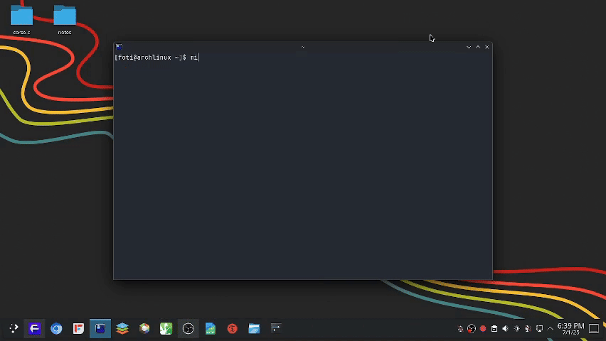

# Mimi - Enhanced AUR Helper

A powerful yet simple AUR helper in Bash for Arch Linux with package management capabilities.



## Description

`mimi` is an enhanced version of `rua` (Old Version) that provides:

- Package installation from AUR
- Package listing and status checking
- Clean removal of packages including source directories

## Features

- List all installed AUR packages (`mimi list`)
- Remove packages with source directories (`mimi remove pkg1 pkg2...`)
- Fast installation with makepkg (`-sic` flags)
- Organized package storage in `~/.mimi/`
- Automatic directory management
- Multiple package operations support

## Requirements

- Arch Linux or Arch-based distribution
- Bash shell
- sudo privileges
- git, makepkg, pacman

## Installation

```bash
git clone https://github.com/antonio-foti/mimi.git
cd mimi
chmod +x mimi
sudo cp mimi /usr/local/bin/
```

## Usage

### Install a package:
```bash
mimi https://aur.archlinux.org/package-name.git
```

### List installed packages:
```bash
mimi list
```

### Remove package(s):
```bash
mimi remove package1 package2
```

## File Structure

Packages are stored in hidden directory:
```
~/.mimi/
   ├── package1/
   ├── package2/
   └── ...
```

## Why mimi?

- leaner directory structure (hidden .mimi)
- Full package management (install/list/remove)
- Maintains original simplicity


## Contribution
Contributions welcome! Open an issue or submit a PR.

## License
MIT License

Maintained by Antonio Foti
